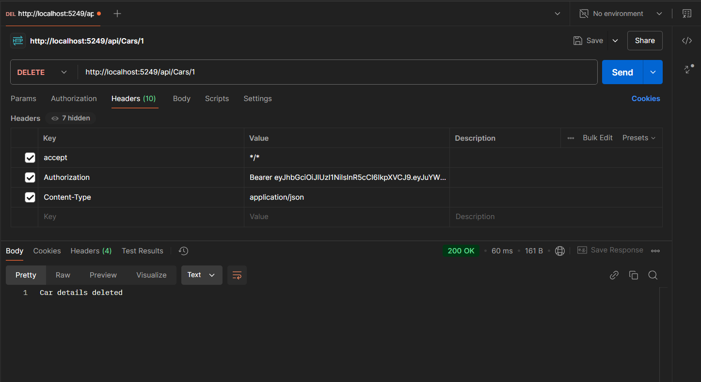

# CarRental

## User Controller

Exposes API endpoints for user registration and authentication.

### Endpoints:

- **POST /users/register:** Register a new user  
  

- **POST /users/login:** Login and get JWT token  
  

## Car Controller

Exposes API endpoints for managing cars.

### Endpoints:

- **GET /cars:** Get a list of available cars (anyone can access it, no auth required, only available cars)  
  

- **POST /cars:** Add a new car to the fleet (added JWT auth in header, only Admin can access)  
    
  No JWT token used:  
    
  When User tries to access it (JWT of User used in header):  
  

- **PUT /cars/{id}:** Update car details and availability (only Admin JWT header can access it)  
  

- **DELETE /cars/{id}:** Delete the car details (only Admin JWT header can access)  
  

- **GET /cars/{id}:** Get car details by ID (anyone can access it, no auth required, only available cars)  
  

- **POST /cars/rentcar:** Rent a car (only User JWT header can access)  
    
  Car Id 2 gets removed from available cars:  
    
  Admin cannot access this:  
  

- **POST /cars/returncar:** Return a car (only User JWT header can access)  
    
  Car Id 2 gets added to available cars:  
  
